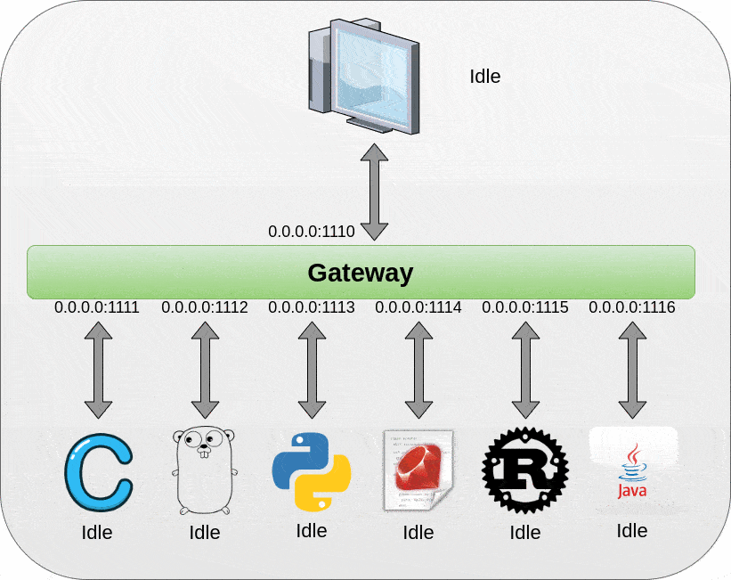
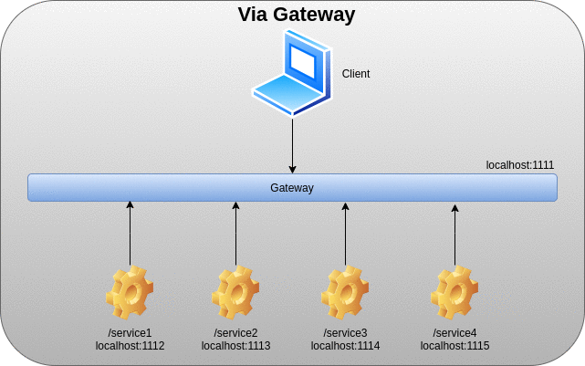

<p align="center">
  
</p>

# Microservices
Este artigo descreve como os serviços presente em uma arquitetura de microserviços pode ser acessada através de um padrão conhecido como API Gateway, e também no acesso ao serviço em si.

# Introdução
Após diversas discussões sobre o que seria a vir microserviços, segue algumas conclusões sobre esse padrão arquitetural:
um microserviço não é somente uma fragmentação de tarefas providas pelo servidor, mas sim um serviço isolado
que contém sua própria interface pública de comunicação, ou seja, é possível ser conectar diretamente ao serviço.
Microservices possui uma grande vantagem em relação aos outros padrões (Monolítico e SOA), porque permite que os serviços
sejam implementados de forma heterogênea, ou seja, cada serviço pode ser implementado com uma tecnologia distinta(C, Python, Rust),
como será visto no caso de uso, porém também traz consigo uma desvantagem, que é a complexidade empregada. Por serem independentes
entre si, o debug da aplicação fica difícil de ser realizado, e exige conhecimento das tecnologias usadas.

# API Gateway

API Gateway é uma padrão que centraliza todas as interfaces de comunicação relativo aos serviços
disponíveis em uma única interface pública, sendo assim tendo como responsabilidade de rotear os
endpoints para a respectiva interface pública que contém o serviço.

# Caso de Uso

Para exemplificar o padrão, foi criado um projeto onde possui uma aplicação Gateway e 6 serviços sendo eles implementados em C, 
Java, Python, Rust, Ruby e Go.

## Representação Gráfica da aplicação
<p align="center">
  
</p>

## Gateway 

A aplicação Gateway é responsável por centralizar todas as requisições providas pelo cliente, e rotear para o endpoint correspondente
através de leitura de um arquivo criado pelos serviços.

## Service

A aplicação Service é responsável por enviar mensagens conforme são cadastradas por passagem de paramêtros. Cada serviço criado
registra sua porta e seu endpoint em um arquivo informando que está disponível.

# Uso
## Build
Para realizar o build execute o script:
```bash
./compile
```


## Usando o Gateway
```bash
./gateway <port>
```

## Usando o Service
```bash
./service <port> <endpoint> <message>
java service <port> <endpoint> <message>
```

Iniciamos o gateway e os serviços
## Exemplo de uso
```bash
./c_service 1111 /c_service "C Service Replying: Hello World!"&
```
```bash
./go_service 1112 /go_service "Go Service Replying: Hallo Welt"&
```
```bash
./python_service.py 1113 /python_service "Python Service Replying: salve Orbis Terrarum"&
```
```bash
./ruby_service.rb 1114 /ruby_service "Ruby Service Replying: Bonjour le monde"&
```
```bash
./rust_service 1115 /rust_service "Rust Service Replying: Ciao mondo"&
```
```bash
java UDPServer 1116 /java_service "Java Service Replying: Olá Mundo"&
```
```bash
./gateway 1110&
```

Com o netstat podemos ver os serviços funcionando

```bash
$ netstat -lvpu | egrep "gateway|_serv|java|ruby|python" 

udp        0      0 0.0.0.0:1110            0.0.0.0:*                           15797/./gateway     
udp        0      0 0.0.0.0:1111            0.0.0.0:*                           15751/./c_service   
udp        0      0 0.0.0.0:1113            0.0.0.0:*                           15753/python        
udp        0      0 localhost:1114          0.0.0.0:*                           15754/ruby          
udp        0      0 localhost:1115          0.0.0.0:*                           15755/./rust_servic 
udp6       0      0 [::]:1112               [::]:*                              15752/./go_service  
udp6       0      0 [::]:1116               [::]:*                              15756/java 
```

Conectamos no gateway e realizamos as requisições

```bash
$ nc -u localhost 1110

/c_service
C Service Replying: Hello World!

/go_service
Go Service Replying: Hallo Welt

/python_service
Python Service Replying: salve Orbis Terrarum

/ruby_service
Ruby Service Replying: Bonjour le monde

/rust_service
Rust Service Replying: Ciao mondo

/java_service
Java Service Replying: Olá Mundo

```

Porém podemos nos conectar diretamente no próprio serviço

```bash
$ nc -u localhost 1111
C Service Replying: Hello World!
```
## Representação gráfica do fluxo de comunicação via Gateway e diretamente
<p align="center">
  
</p>


# Conclusão 
Com diversos tutoriais disponíveis na internet, poucos ressaltam a necessidade de que cada serviço deve possuir sua própria interface
de comunicação, dessa forma cada serviço se transforma em um servidor independente, capaz de prover o serviço sem a dependência 
de outro serviço, podendo ser acessado através de um gateway (proxy reverso) ou diretamente.

O link para o projeto [here](https://github.com/NakedSolidSnake/C_Microservices)
